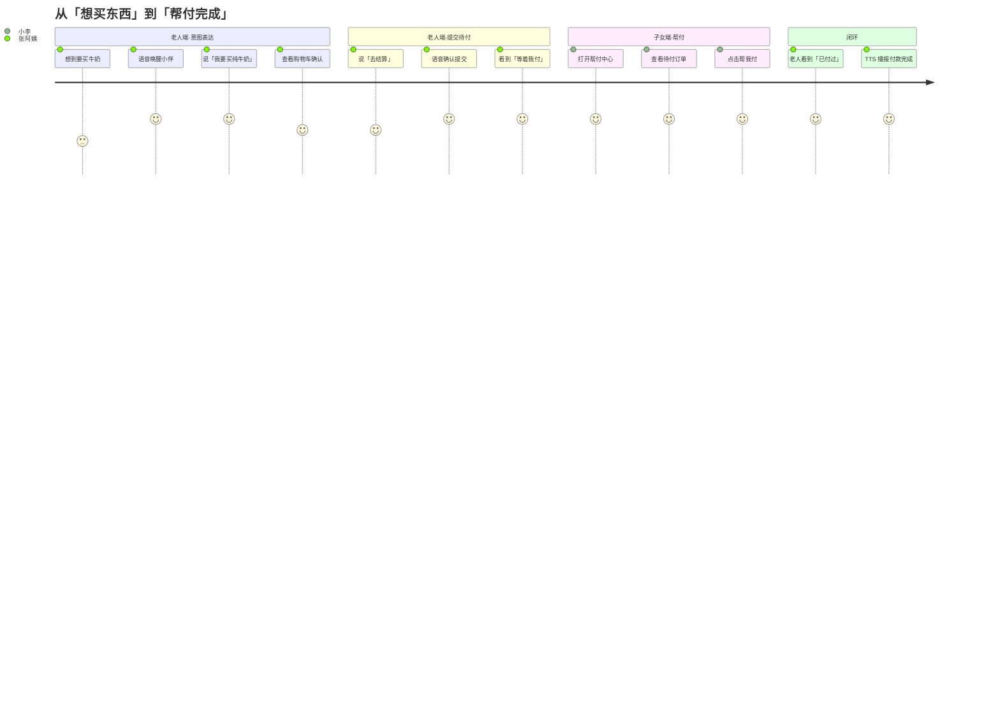

# SeniorShop 用户画像（Persona）

## Persona 1：张阿姨 — 老年购物者

| 属性 | 描述 |
|------|------|
| **年龄** | 68 岁，退休教师 |
| **技术经验** | 会用微信发语音、看朋友圈；不敢在淘宝独自付款 |
| **视力** | 老花眼，小字看不清，强光下屏幕反光更明显 |
| **手部能力** | 手指轻微颤抖，怕点错按钮 |
| **购物习惯** | 每周让儿子帮忙买牛奶、日用品；自己很少主动网购 |
| **核心痛点** | ① 界面太复杂，找不到入口 ② 怕误付款 ③ 专业术语看不懂 |
| **目标** | 用说的方式选东西，不必独自完成支付 |
| **典型语录** | 「我就想买点牛奶，怎么这么多字？」「这个等着我付是什么意思？」 |

### 张阿姨的一天（购物场景）

> 早上喝完粥，发现牛奶没了。她打开 SeniorShop，说「你好小伴，我要买纯牛奶」。小伴帮她加进购物车。她又说了「看看购物车」「去结算」。屏幕上显示「等着子女帮忙付钱」——她松了一口气，知道儿子会帮她付。

---

## Persona 2：小李 — 子女帮付者

| 属性 | 描述 |
|------|------|
| **年龄** | 35 岁，互联网公司产品经理 |
| **与老人关系** | 张阿姨的儿子，异地工作 |
| **技术经验** | 熟练使用各类 App，但没时间远程教父母操作 |
| **核心痛点** | ① 远程电话教操作成本高 ② 担心父母误买药品或大额消费 ③ 帮付流程不透明 |
| **目标** | 随时看到父母的待付订单，一键帮付，收到安全提醒 |
| **典型语录** | 「妈你别自己付，我来」「有药品的话我得先看看」 |

### 小李的协作场景

> 午休时收到妈妈提交的待付订单。打开 SeniorShop 子女端，帮付中心有一条「等着我付」——纯牛奶 ¥12.5。他点「帮我付」，订单变「已付过」。晚上打电话告诉妈妈：「已经付好了。」

---

## 用户旅程图

---

## 设计目标（由 Persona 推导）

1. **敢选**：大按钮、暖色、通俗文案，降低视觉与语言门槛
2. **会选**：语音 + AI 意图识别，用自然语言代替菜单导航
3. **不必独自付**：亲情帮付将支付决策外包给信任的子女
